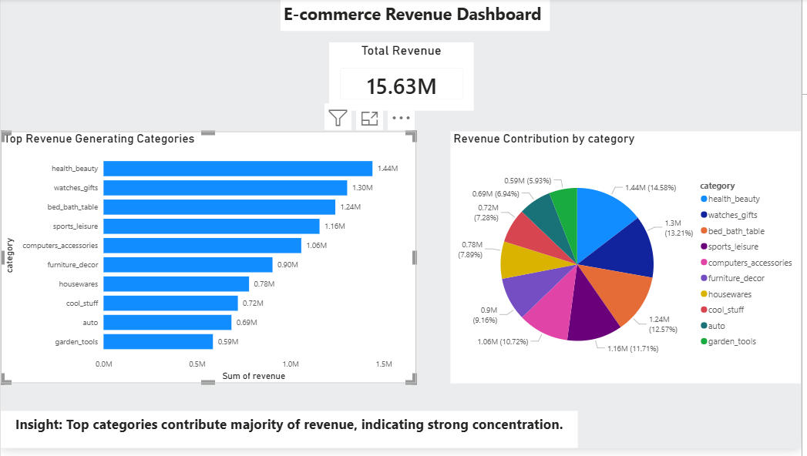
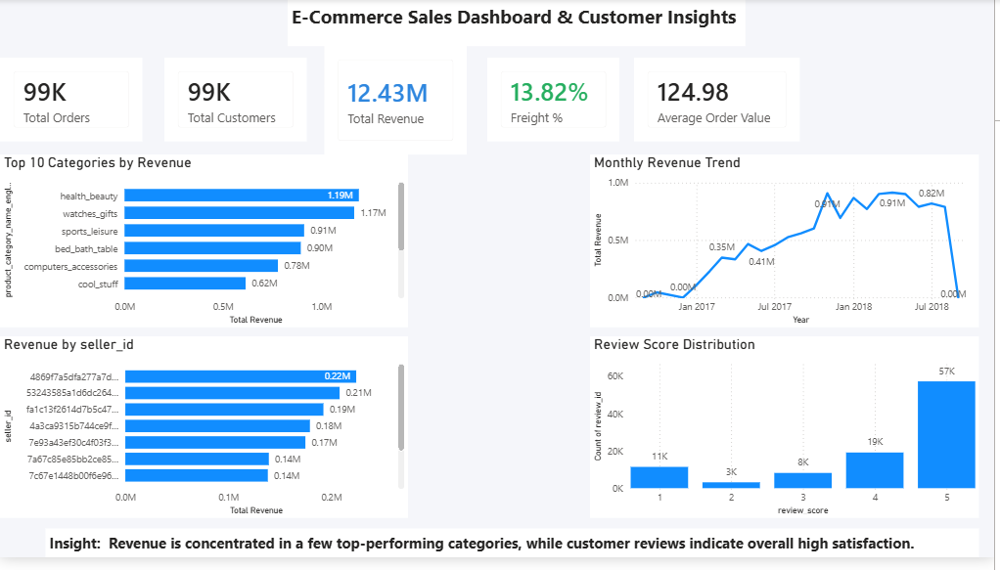

# 📊 E-Commerce Analytics Project (SQL + Python + Power BI)

## 📌 Overview
This project is an end-to-end **E-commerce Data Analytics solution** combining **SQL, Python, and Power BI** to analyze sales performance, customer behavior, and product trends.

The goal is to extract actionable insights from raw transactional data and present them through an interactive dashboard.

---

## 🗂️ Project Structure
ecommerce-analytics-project/
│
├── data/ # Raw and processed datasets
├── python/ # Python scripts for EDA and analysis
├── sql/ # SQL queries and analysis
├── outputs/ # Charts and visual outputs
├── screenshots/ # Power BI dashboard images
├── requirements.txt # Python dependencies
└── README.md # Project documentation


---

## 📊 Power BI Dashboard

The dashboard includes:

- 💰 Total Revenue
- 📦 Total Orders
- 👥 Total Customers
- ⭐ Average Review Score
- 🚚 Freight Value Analysis
- 📈 Monthly Revenue Trends
- 🏆 Top Product Categories

### 📷 Dashboard Preview

#### Stage 1 Dashboard


#### Stage 2 Dashboard


---

## 🧹 Data Processing

### Python (EDA)
- Handled missing values
- Removed duplicates
- Created revenue-based features
- Performed exploratory data analysis (EDA)

### SQL
- Aggregated sales data
- Created category-level insights
- Performed revenue breakdown analysis

---

## 📈 Key Insights

- Revenue shows seasonal fluctuations across months
- A small number of product categories contribute most of the revenue
- Freight cost significantly impacts total order value
- Customer ratings are generally positive (avg ~4.0+)

---

## ⚙️ Tech Stack

- Python (Pandas, NumPy, Matplotlib, Seaborn)
- SQL (Data aggregation & transformation)
- Power BI (Dashboard & visualization)
- Git & GitHub (Version control)

---

## 📦 Installation

```bash
pip install -r requirements.txt

📁 requirements.txt
pandas
numpy
matplotlib
seaborn

🚀 Author

Hamais Ahmed

Data Analytics Project
GitHub Portfolio Project
